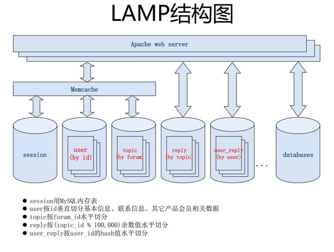

**目录**

[TOC]

#Hello world!
##Hello world!                
###Hello world!
####Hello world!
#####Hello world!
######Hello world!

###横线等基本语法
                
----

~~删除线~~
*斜体字*
**强调字体**

> 引用文本 [示例链接](http://localhost/)

###多语言代码高亮

####JS代码　

```javascript
function test(){
	console.log("Hello world!");
}
 
(function(){
    var box = function(){
        return box.fn.init();
    };

    box.prototype = box.fn = {
        init : function(){
            console.log('box.init()');

			return this;
        },

		add : function(str){
			alert("add", str);

			return this;
		},

		remove : function(str){
			alert("remove", str);

			return this;
		}
    };
    
    box.fn.init.prototype = box.fn;
    
    window.box =box;
})();

var testBox = box();
testBox.add("jQuery").remove("jQuery");
```

####HTML代码

```html
<!DOCTYPE html>
<html>
    <head>
        <mate charest="utf-8" />
        <title>Hello world!</title>
    </head>
    <body>
        <h1>Hello world!</h1>
    </body>
</html>
```
                
###图片


                    
> 引用：如果想要插入空白换行`即<br />标签`，在插入处先键入两个以上的空格然后回车即可。
                
----

###列表

####无序列表（横线）
                
- 列表一
- 列表二
- 列表三
     
####无序列表（星号）

* 一
* 二
* 三

####有序列表
                
1. 第一行
2. 第二行
3. 第三行
                
----
                    
### 绘制表格

| 项目        | 价格   |  数量  |
| --------   | -----:  | :----:  |
| 计算机      | $1600   |   5     |
| 手机        |   $12   |   12   |
| 管线        |    $1    |  234  |
                    
First Header  | Second Header
------------- | -------------
Content Cell  | Content Cell
Content Cell  | Content Cell 

| First Header  | Second Header |
| ------------- | ------------- |
| Content Cell  | Content Cell  |
| Content Cell  | Content Cell  |

执行命令：`npm install marked`
                
----
            
###科学公式
                    
$$E=mc^2$$

行内的公式$$E=mc^2$$行内的公式，行内的$$E=mc^2$$公式。

$$\(\sqrt{3x-1}+(1+x)^2\)$$
                    
$$\sin(\alpha)^{\theta}=\sum_{i=0}^{n}(x^i + \cos(f))$$
                
###绘制流程图

```flow
st=>start: 用户登陆
op=>operation: 登陆操作
cond=>condition: 登陆成功 Yes or No?
e=>end: 进入后台

st->op->cond
cond(yes)->e
cond(no)->op
```
                    
###绘制序列图
                    
```seq
Andrew->China: Says Hello 
Note right of China: China thinks\nabout it 
China-->Andrew: How are you? 
Andrew->>China: I am good thanks!
```

###结束